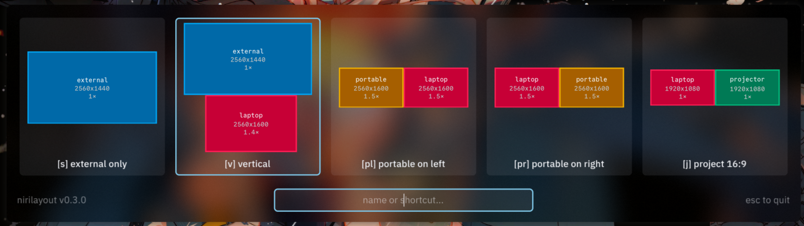

# nirilayout

nirilayout is a simple tool to quickly switch your
[niri](https://github.com/YaLTeR/niri) output configuration between different
layouts. Especially useful for laptop users who move between different setups
frequently.



nirilayout works by keeping the `output` blocks for each user-defined layout in
separate files in the niri config directory, then symlinking the currently
active layout to `nirilayout.kdl` and including that in the main `config.kdl`.

A graphical GTK switcher displays the available layouts with a preview of the
output arrangement, and allows you to switch between them with the keyboard or
mouse. nirilayout-specific comments in the layout files allow you to
customize the switcher and the previews.

## Usage

### Install nirilayout

**On Linux x86_64?** Download the latest precompiled binary from the
[releases page](https://github.com/calico32/nirilayout/releases). Add it to your
path and you're good to go!

Otherwise, to build from source, install Go 1.25+, GTK 4.16+ and [GTK4 Layer
Shell](https://github.com/wmww/gtk4-layer-shell). Clone this repo, then run
`make install` to install nirilayout to $GOBIN. Alternatively, run `make` to
build nirilayout to the current directory.

### Configure layouts

In `~/.config/niri`, create layouts for your different setups in files
named `layout_<name>.kdl`.

For example, `layout_vertical.kdl` might look like this:

```kdl
//! name "Vertical"
//! shortcut "v"
//! style font-family="sans-serif"

output "Lenovo Group Limited E27q-20 V5HDD696" {
    //! name "external"
    mode "2560x1440@74.780"
    scale 1
    position x=0 y=0
}

output "BOE 0x0AC1 Unknown" {
    //! name "laptop"
    //! style fill=9
    mode "2560x1600@120.001"
    scale 1.5
    position x=427 y=1440
}
```

Each layout file should contain the `output` blocks that niri should use in this
layout (see [docs](https://niri-wm.github.io/niri/Configuration%3A-Outputs.html)).
Then, add special comments throughout the file to configure the switcher.
**nirilayout reads the existing KDL as well as any line beginning with
`//!` — these are uncommented and parsed as KDL.** As such, follow KDLv1 syntax
rules when writing them.

#### Global options

Global options, outside of any `output` block, apply to the layout as a whole.

- **`//! name "<name>"`**: The name of the layout. This is what will be shown in the
  switcher. If not specified, the name of the file (without the `layout_` prefix
  and `.kdl` suffix) will be used.
- **`//! shortcut "<shortcut>"...`**: The shortcut(s) to use for this layout.
  You can specify multiple shortcuts by providing several strings (e.g.
  `//! shortcut "v" "V"`). Shortcuts are case-sensitive.

    **Shortcuts cannot be prefixes of other shortcuts.** As soon as you finish
    typing a shortcut, the switcher will immediately select that layout. This
    means that if you have both "a" and "ab" as shortcuts, typing "a" will
    immediately select the first layout and you won't be able to type "ab".

- **`//! style [prop=value]...`**: Customize the preview style defaults for this
  layout. You can set any of the following properties:
    - `fill=<color>`: output fill color (default: auto-assigned based on output name)
    - `border=<color>`: output border color (default: fill at 1.2× brightness)
    - `text=<color>`: text color (default: auto-assigned based on fill color)
    - `border-width=<number>`: border width, pixels (default: 2)
    - `font-family="<name>"`: output label font family (default: monospace)
    - `font-size=<number>`: output label font size, pixels (default: 10)
    - `hide-details=<true|false>`: whether to hide the output mode and scale in
      labels (default: false)
    - `line-spacing=<number>`: line spacing for output labels, pixels (default: 4)

#### Per-output configuration

These options should be specified inside the `output` block they are configuring.

- **`//! name "<name>"`**: Specifies a custom name for this output. If not
  specified, the name given to niri (`output "..."`) will be used.
- **`//! style [prop=value]...`**: Set style properties for this output, which
  override the layout defaults. See the list of style properties above.
- _`//! color <number>` (deprecated)_: Specifies a custom color for this output.
  nirilayout will pick a color for each display based on its name, but you can
  pick a custom color yourself by setting this option to a number between 0 and 17.
  0 is gray and 1-17 are preset colors from the Tailwind CSS palette.

    | Index | Color  |     | Index | Color   |     | Index | Color   |
    | ----- | ------ | --- | ----- | ------- | --- | ----- | ------- |
    | 0     | gray   |     | 6     | green   |     | 12    | indigo  |
    | 1     | red    |     | 7     | emerald |     | 13    | violet  |
    | 2     | orange |     | 8     | teal    |     | 14    | purple  |
    | 3     | amber  |     | 9     | cyan    |     | 15    | fuchsia |
    | 4     | yellow |     | 10    | sky     |     | 16    | pink    |
    | 5     | lime   |     | 11    | blue    |     | 17    | rose    |

    This option is deprecated in favor of using `//! style fill=<color>`, but is
    still supported for backwards compatibility.

- **`//! mode "WWWxHHH"`**: If you don't want to specify a mode to niri, you'll
  need to explicitly set a nirilayout-only mode using this option so that the
  switcher knows how to draw the preview.

#### Color values

Several color formats are understood:

- `#RGB`, `#RGBA`, `#RRGGBB`, `#RRGGBBAA` hex codes
- `rgb(R, G, B)` and `rgba(R, G, B, A)` functions, where R/G/B/A are integers
  between 0 and 255
- A color index between 0 and 17, which corresponds to a preset color in the
  Tailwind CSS palette (see the table above). Only valid for `fill`/`border` or
  `//! color`.
- A named Tailwind CSS color, like `red500` or `blue200`

### Optional: Configure custom CSS

You can further customize the look of the switcher by editing the file
`~/.config/niri/nirilayout.css`. Any styles in this file will be loaded as GTK
user styles, overriding your GTK theme and the default application styles. You
can copy [style.css](style.css) in this repo as a starting point.

For example, to make the window translucent:

```css
/* In ~/.config/niri/nirilayout.css: */
window {
	background-color: #00000080;
}
```

### Configure niri

Now, run `nirilayout` once to select an initial layout. This creates
`~/.config/niri/nirilayout.kdl`, a symlink to the layout you selected.

Finally, remove any `output` blocks in `~/.config/niri/config.kdl` and add an
include to load `nirilayout.kdl`.

```kdl
// In config.kdl:
include "nirilayout.kdl"
```

Optionally, add a keybinding to spawn `nirilayout` to make it easier to switch.

```kdl
// In config.kdl:
binds {
    // ...
    Mod+P { spawn "nirilayout"; } // Assuming nirilayout is on $PATH
    // ...
}
```

All done!

## Use nirilayout

Run `nirilayout` again (or use your keybinding) to switch between your layouts.

In the switcher, you can select a layout with `←`/`→`/`Return` or the mouse. You
can also type the name of a layout or its shortcut to select it. Shortcuts and
names are case-sensitive. As soon as you finish typing a shortcut, the switcher
will immediately select that layout, so make sure your shortcuts are not
prefixes of each other.

Layouts are presented in lexicographical order by name. If you want to change
the order, you can rename the files in the config directory.

## Automatic recovery (watch mode)

A layout that turns an output `off` keeps it off even when the situation
changes. For example, an "external only" layout with

```kdl
//! output "eDP-1" { off }
```

leaves the built-in panel off. If you then unplug the external monitor — or boot
with it already unplugged — niri honors that `off` and no output is left
drawing, so you get a black screen. nirilayout only ever runs when you launch it
by hand, so on its own it cannot react to a cable being pulled.

Watch mode fixes this. Run

```sh
nirilayout --watch
```

and nirilayout stays in the background instead of showing the GUI. Whenever no
output is active, it applies a *safe* layout and niri reloads it, lighting a
screen back up. It reacts to niri events immediately and also polls periodically
as a safety net.

By default the safe layout is auto-picked: among your layouts, nirilayout
chooses one whose enabled outputs are all currently connected, preferring the
one that lights up the most monitors (so a single laptop panel is used only when
nothing better is plugged in). To force a specific layout instead, name it with
`--fallback`:

```sh
nirilayout --watch --fallback "Laptop Only"
```

To have it always running, spawn it at niri startup:

```kdl
// In config.kdl:
spawn-at-startup "nirilayout" "--watch"
```

Watch mode never touches the screen while an output is already active, so it is
safe to leave running alongside normal use of the GUI switcher.

## Command-line options

| Option        | Description                                                                                  |
| ------------- | -------------------------------------------------------------------------------------------- |
| `-c <dir>`    | niri config directory (default `~/.config/niri`).                                            |
| `-lang <code>`| Interface language code, e.g. `it`. Overrides the system locale. See [Localization](#localization). |
| `-lowercase`  | Render all of nirilayout's own interface text in lowercase. See [Casing](#casing).           |
| `-leftalign`  | Left-align the text in the search box. See [Search box alignment](#search-box-alignment).    |
| `-watch`      | Run as a background daemon that recovers a black screen instead of showing the GUI. See [Automatic recovery](#automatic-recovery-watch-mode). |
| `-fallback <name>` | In watch mode, the layout to apply when no output is active. See [Automatic recovery](#automatic-recovery-watch-mode). |

Run `nirilayout -h` for the full list.

## Appearance

### Casing

By default nirilayout uses standard sentence casing for its own interface text
(for example `Esc to quit`). If you prefer everything in lowercase, pass the
`-lowercase` flag:

```sh
nirilayout -lowercase
```

This only affects nirilayout's own interface strings — the names of your layouts
and outputs are always shown exactly as you wrote them.

### Search box alignment

The text you type into the search box is centered by default. Pass the
`-leftalign` flag to left-align it instead:

```sh
nirilayout -leftalign
```

## Localization

nirilayout's interface can be translated. The language is chosen automatically,
with the following precedence:

1. The `-lang` flag, when set, wins over everything (e.g. `nirilayout -lang it`).
2. Otherwise the operating system locale is used, read from the `LC_ALL`,
   `LC_MESSAGES`, and `LANG` environment variables (in that order). A locale
   like `it_IT.UTF-8` is matched to its base language `it`.
3. Otherwise English is used.

If the selected language has no translation, nirilayout falls back to English.

Currently available languages:

- English (`en`, source language)
- Italian (`it`)

### Adding a translation

Translations use [gettext](https://www.gnu.org/software/gettext/). The compiled
`.mo` catalogs are committed to the repository and embedded into the binary, so
**building or running nirilayout never requires any gettext tooling**. You only
need the gettext tools (`xgettext`, `msgmerge`, `msgfmt`) to *edit* translations.

To add a new language (using French, `fr`, as an example):

1. Refresh the message template and existing translations from the source:

   ```sh
   make update-po
   ```

2. Create the catalog directory and initialize the `.po` file from the template:

   ```sh
   mkdir -p locales/fr/LC_MESSAGES
   msginit -i locales/nirilayout.pot -o locales/fr/LC_MESSAGES/nirilayout.po -l fr
   ```

3. Translate the `msgstr` entries in `locales/fr/LC_MESSAGES/nirilayout.po`.

4. Compile the catalogs (this produces the committed `.mo` files):

   ```sh
   make i18n
   ```

5. Add the new language to the list above and open a pull request.

To update an existing translation, edit its `.po` file, run `make i18n`, and
commit both the `.po` and the regenerated `.mo`.

# Contributing

Contributions are welcome! If you find a bug or have a feature request, please
open an issue or a pull request. Translations are especially welcome — see
[Adding a translation](#adding-a-translation).

# License

nirilayout is licensed under the MIT license. See [LICENSE](LICENSE) for more
information.
